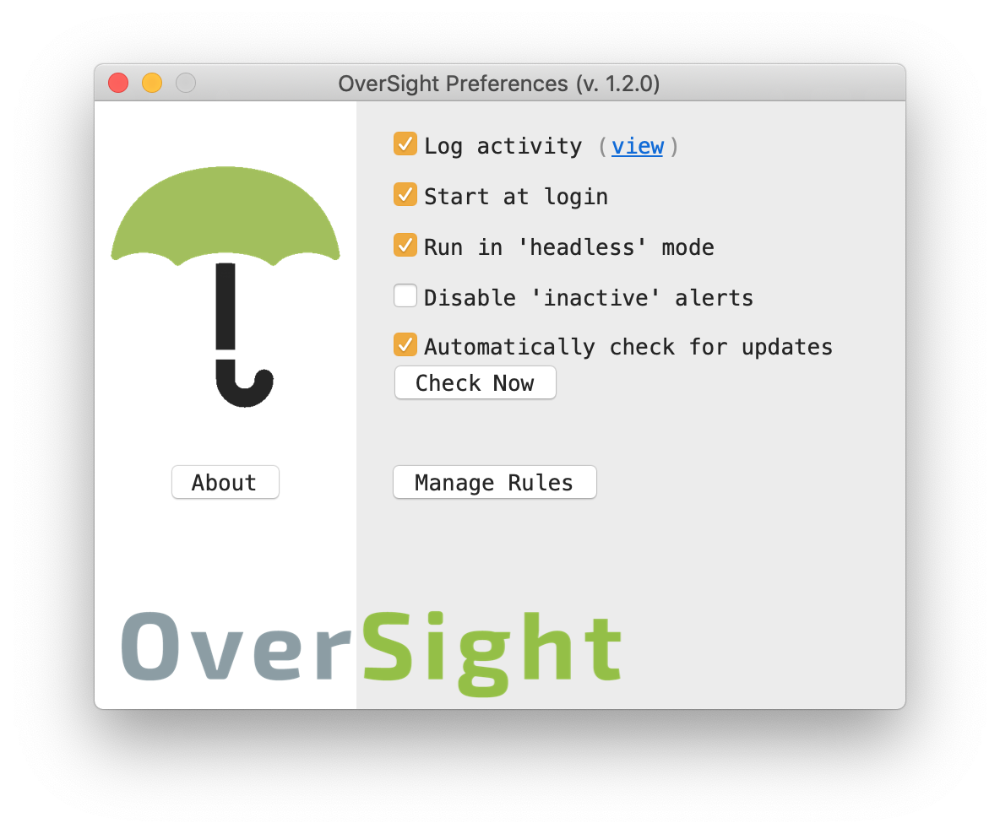
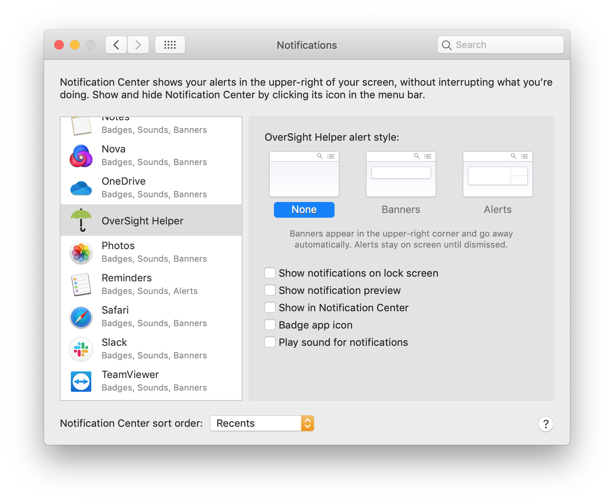

# Webcam Activity → Hue Light

MacOS only.

1. Get and install [OverSight](https://objective-see.com/products/oversight.html) (Free, closed source)
2. Configure as such:
   
3. This is a bit weird but don't "always allow" your apps. This will mute them from logging.
4. Instead, shush up the notifications. Change the type to "Banner" (suggested) or "None."
   
5. This dumb-ass app will just watch the log file of OverSight Helper. On first run it will create an API user (see example cribbed from [GitHub](https://github.com/peter-murray/node-hue-api/blob/master/examples/v3/discoverAndCreateUserScript.js)). In subsequent runs, you can customize the LIGHT_ID, or see examples [how to search lights by name](https://github.com/peter-murray/node-hue-api/blob/master/examples/v3/lights/getLightByName.js).
6. Add to launch agents, wrap in applescript, or add to Login Items, or your favourite way to launch the script once per login session.

